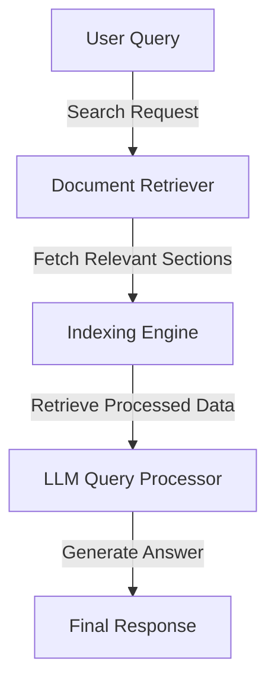

# RAG-based Generative Search System for Insurance Policy Documents

## Overview
This project implements a **Retrieval-Augmented Generation (RAG) system** to efficiently retrieve information from insurance policy documents using **Large Language Models (LLMs)**. The system enables users to ask natural language queries and receive accurate, context-aware responses generated from insurance policies.

## Problem Statement
Insurance policies contain extensive details, making it difficult for users to retrieve specific information quickly. Traditional keyword-based search is inefficient, requiring users to manually scan through large documents. This project addresses these challenges by integrating **document retrieval mechanisms with generative AI**, providing precise answers based on policy documents.

## Approach
The system follows the **RAG (Retrieval-Augmented Generation) architecture**, combining:
- **Document Retrieval**: Extracts the most relevant sections from policy documents.
- **LLM-powered Text Generation**: Uses an AI model to generate coherent, context-aware responses.

## Features
✅ Efficient document ingestion (PDF, DOCX, TXT parsing)  
✅ Advanced text preprocessing (tokenization, cleaning)  
✅ Intelligent retrieval of relevant policy sections  
✅ Natural language processing for user queries  
✅ Integration with OpenAI's GPT for response generation  

## Technologies Used
- **Python**: Core language for implementation  
- **LangChain / LlamaIndex**: Handles document indexing and retrieval  
- **OpenAI GPT API**: Generates responses based on retrieved content  
- **PyPDF, docx2txt**: Parses policy documents  
- **Jupyter Notebook**: Development and testing environment  

## System Architecture


## Installation & Setup
1. Clone the repository:
   ```bash
   git clone https://github.com/your-repo/RAG-Insurance-Search.git
   cd RAG-Insurance-Search
   ```
2. Install required dependencies:
   ```bash
   pip install -r requirements.txt
   ```
3. Run the project in a Jupyter Notebook or Python script.

## Usage
- Upload insurance policy documents (PDF/DOCX/TXT).  
- Enter a natural language query related to policy terms.  
- The system retrieves relevant sections and generates a precise response.  

## Future Enhancements
🔹 Enhance retrieval with vector embeddings (FAISS, ChromaDB)  
🔹 Improve LLM fine-tuning for insurance-specific queries  
🔹 Deploy as a web-based chatbot or API service  

## Contributing
Contributions are welcome! Feel free to fork this repository and submit pull requests.

## License
This project is licensed under the **MIT License**.

---
🚀 **Unlock the power of AI-driven search in insurance with RAG!**  
